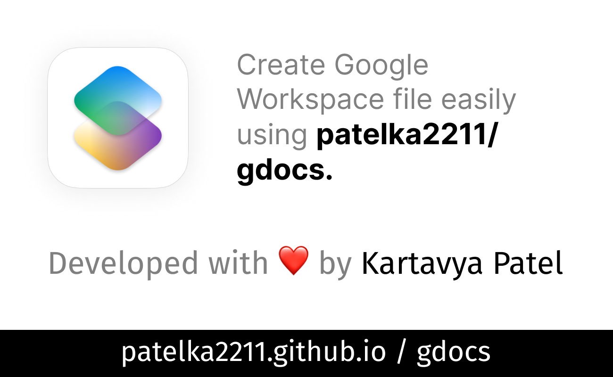

# view

-   Create Google Workspace file easily using patelka2211/gdocs.

    

        <!--  -->
        
        

            github.com /
            <code>
            <a href="https://github.com/patelka2211/gdocs" title="patelka2211/gdocs on GitHub" target="blank_" style="cursor: pointer;">
                <a href="https://github.com/patelka2211" title="patelka2211 on GitHub" style="text-decoration: none;color: #58a6ff;" target="blank_">patelka2211</a> / <a href="https://github.com/patelka2211/gdocs" title="patelka2211/gdocs on GitHub" style="text-decoration: none;color: #58a6ff;" target="blank_">gdocs</a>
            </a>
        </code>
        

    

---

# Description

It helps to create Google Workspace file easily.

# About languages

|                                                                 Total used languages                                                                  |                                     Top language                                      |
| :---------------------------------------------------------------------------------------------------------------------------------------------------: | :-----------------------------------------------------------------------------------: |
|  |  |

# License

&copy; 2022
<a href="https://github.com/patelka2211" title="Kartavya Patel" style="margin-left: 5px;">Kartavya Patel</a>

